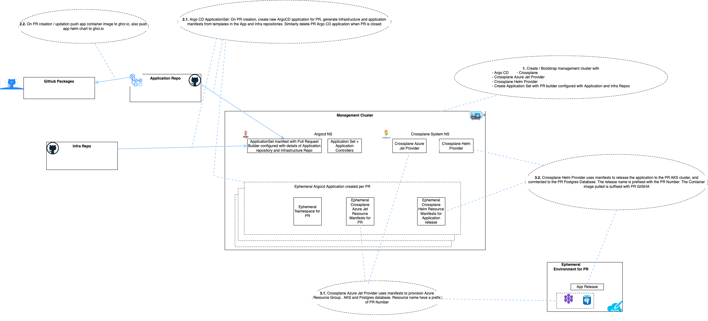

# Sample Application to test ephemreal environments

## Initial Sample Application Code
This sample app is initially taken from [quickstart-spring-data-jdbc-postgresql](https://github.com/Azure-Samples/quickstart-spring-data-jdbc-postgresql) Azure Samples, and then modified for purpose of creating ephemeral test environments.

## Purpose of the Sample Application

Once setup a PR againsV this repository will result in creation of a new ephemeral environment for this PR, with a new Azure Resource group which contains an AKS cluster and Postgres SQL database. A version of this application corresponding to the PR commit SHA is then deployed to this ephemeral environment. The creation of Infrastructure and application release are all done using the GitOps way.

The first implemented sample uses ArgoCD (with ApplicationSet + PR Generator), Crossplane Azure Jet Provider (for provisioning / deleting Azure Resources), and Crossplane Helm provider (for releasing / updating the application). 

### Solution Overview

## Assoicated code repositories needed to wire up the solution

[ephemeral-env-infra](https://github.com/maniSbindra/ephemeral-env-infra.git): This is the Platform repository which contains the manifests / templates to provision the cloud services / resources needed for the ephemeral environment

[ephemeral-mgmt](https://github.com/maniSbindra/ephemeral-mgmt.git): This contains the scripts to bootstrap the management cluster, and applying the ArgoCD ApplicationSet (with PR Generator)

## Detailed documentation to wire up the cluster to follow
